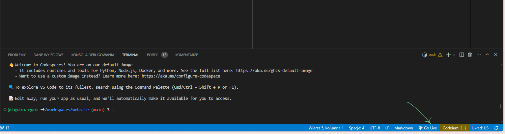
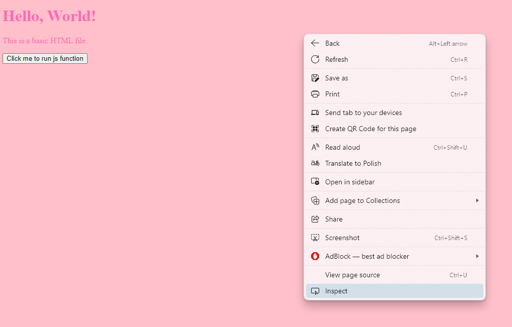
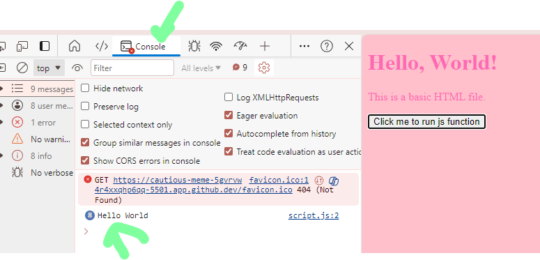
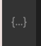
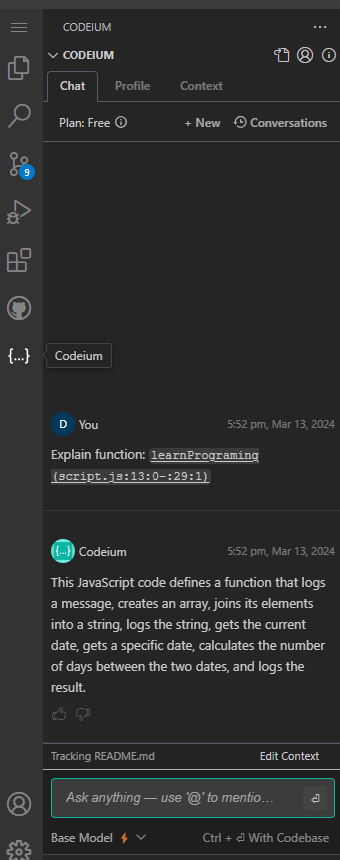
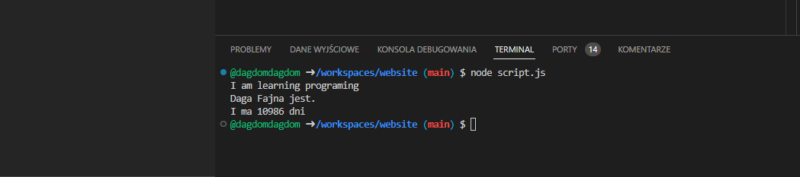
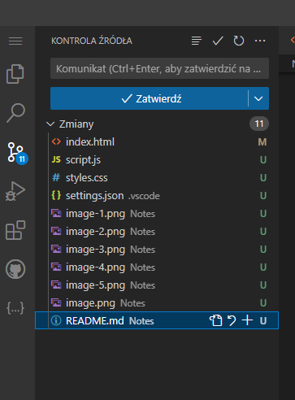

# How to

To see results of changing html/css/js click 'Go Live'

It should open the page in new tab

Then after each change and save it should reload automatically. If not click F5 or F5+ctrl (refresh)

## DevTools:
Right mouse click and inspect

or press F12

In devtools we could check console logs:

## Use codeium if you have any questions:

## Run scripts from terminal

With commend: node script.js

## To save changes learn how to use source control

